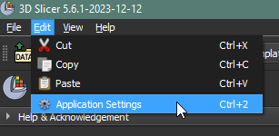
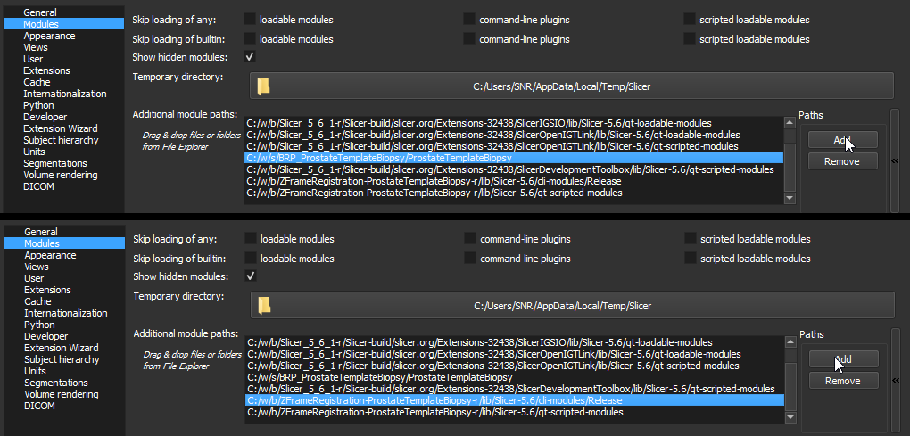
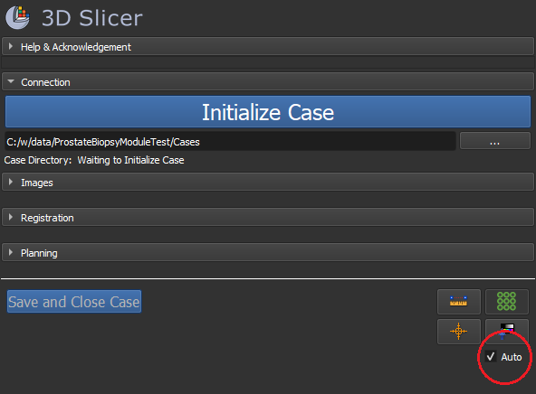
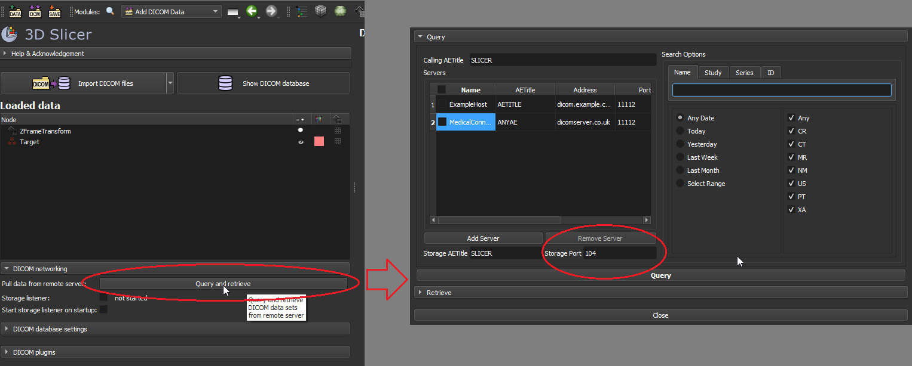
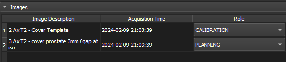
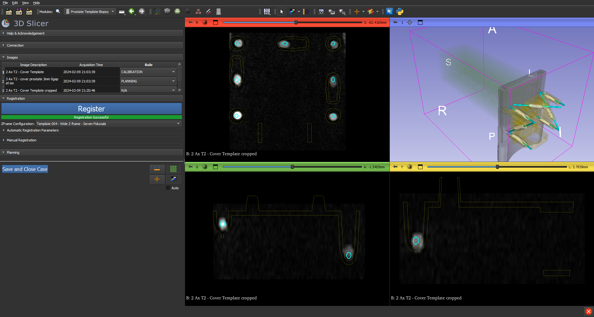
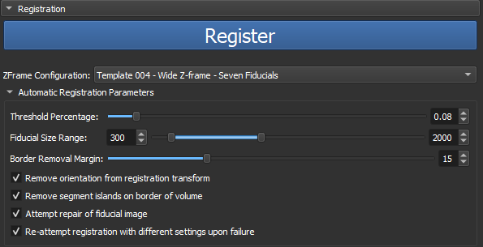
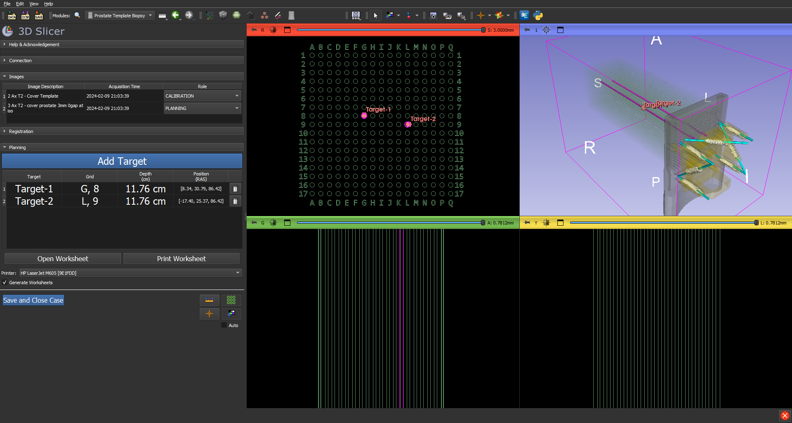
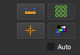

### Installation

Designed for use with 3D Slicer 5.6.1 Stable Release. Download from http://download.slicer.org

Specifically requires the ZFrameRegistration CLI module to be built from https://github.com/SNRLab/ZFrameRegistration-ProstateTemplateBiopsy

Requires SlicerDevelopmentToolbox. Download and install from the 3D Slicer Extensions Manager: https://slicer.readthedocs.io/en/latest/user_guide/extensions_manager.html

Requires scikit-image, PyPDF2, reportlab, and win32print for template worksheet generation. Python packages should install on their own but some packages (such as win32print) may require a restart of 3D Slicer.

Optionally requires [Foxit PDF Reader](https://www.foxit.com/pdf-reader/) if printing template worksheets from the 3D Slicer module is desired.

Add both the Prostate Template Biopsy and ZFrameRegistration modules to 3D Slicer's Additional module paths as indicated:

### Usage

Set default settings in /BRP_ProstateTemplateBiopsy/ProstateTemplateBiopsy/Resources/Defaults.ini

The Auto functionality enables the automatic progression of Registration and Planning upon receiving images. If this functionality is not desired then disable using this checkbox:

Start by selecting a directory to store case data and clicking the Initialize Case button. This starts the DICOM listener, creates a new directory for the individual case, and readies the module to receive images. If a different port is needed for the DICOM listener then it must be changed from 3D Slicer's DICOM module:

As images are received by the module, they will appear in the Image list. Their role is automatically detected by keywords in the Image Description, but this can be overridden by the user. Clicking on an image description will change 3D Slicer's display to display the selected image.

Registration will occur automatically upon receiving the appropriate image or when the Register button is clicked depending on the status of the Auto checkbox. The Template Configuration combo box should be selected in advance (or set in Defaults.ini) to match the configuration used.

The automatic registration uses several strategies to detect the registration fiducials. If registration is successful a bar indicating the success status will appear under the Register button. The parameters can be set in the Automatic Registration Parameters menu:

If automatic registration fails, then a bar indication failure will appear and the Manual Registration Parameters menu will open. The user can manually adjust the Translation and Rotation using the sliders. When the result is acceptable, the Accept Manual Regisstration button should be clicked to prepare the module for the Planning step.

Click on Add Target to change the cursor to allow for adding a target. Upon placing a target, the target name, grid coordinate on the template, depth, and position in RAS are displayed in the Target List. Targets can be renamed or deleted.

Double click on a Slice View to expand it if desired and double click again to shrink it. The template overlay can be hidden using the toggle at the bottom of the module UI. Windowing and leveling can also be changed by enabling the windowing/leveling toggle and dragging across the 3D Slicer slice windows.

Click on the Open Worksheet button to display the Template Worksheet and the Print Worksheet button to print it (only available in Windows). There is currently a limit of 24 targets (12 pages) that can be added to template worksheets.

At this point, any further images added to the scene will be saved in the 3D Slicer scene but will not affect the function of the module.

Click the Save and Close Case button to save the 3D Slicer data in the case directory and refresh the module to prepare for the next case. DICOM images along with the targets and scene will be saved in an .MRB file.

### Disclaimer

**This is NOT an FDA-approved medical device**. It is not intended for clinical use. The user assumes full responsibility to comply with the appropriate regulations.  

### Acknowledgments

Several components were adopted from the following open source projects:
* Needle guidance core functionality was adopted from
  https://github.com/ProstateBRP/NeedleGuideTemplate, courtesy Junichi
  Tokuda @tokjun
* [Z-frame calibration](https://github.com/SlicerProstate/SliceTracker/commits/master/ZFrameCalibration)
  was adopted from the [ProstateNav module of 3D Slicer version
  3](https://www.slicer.org/slicerWiki/index.php/Modules:ProstateNav-Documentation-3.6)
